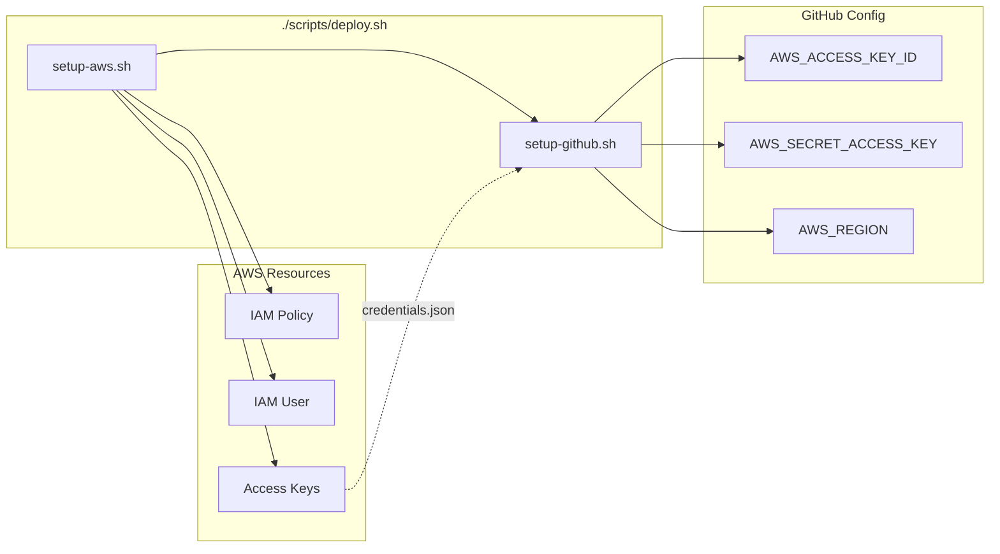
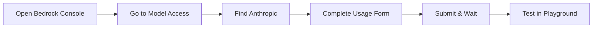
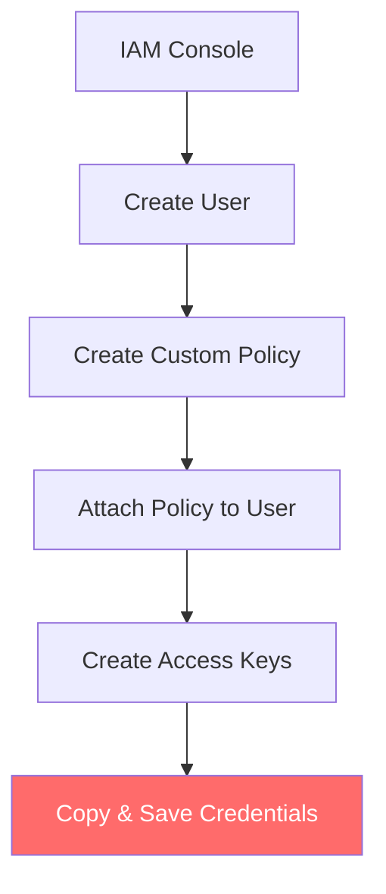
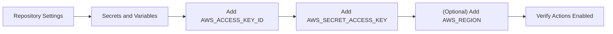
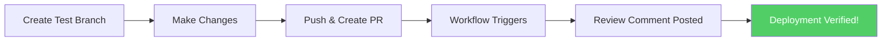
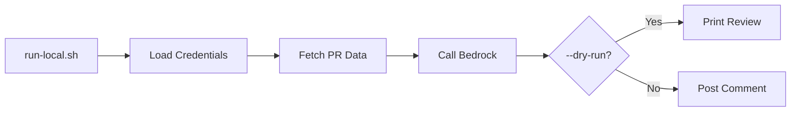
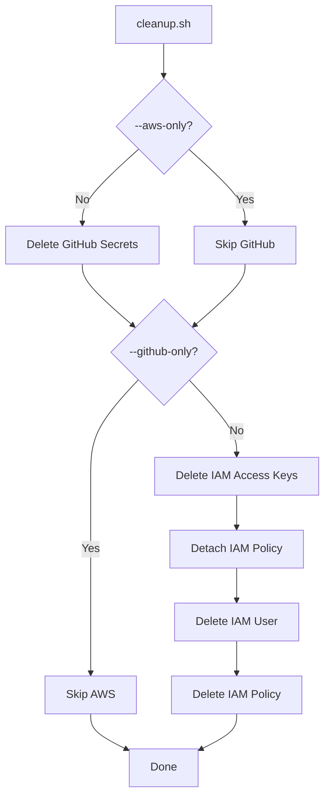

# Deployment Guide

Complete step-by-step guide to deploy the Amazon Bedrock PR Code Reviewer.

---

## Table of Contents

1. [Quick Deploy (Automated)](#quick-deploy-automated)
2. [Prerequisites](#prerequisites)
3. [Step 1: AWS Account Setup](#step-1-aws-account-setup)
4. [Step 2: Enable Bedrock Model Access](#step-2-enable-bedrock-model-access)
5. [Step 3: Create IAM User](#step-3-create-iam-user)
6. [Step 4: Configure GitHub Repository](#step-4-configure-github-repository)
7. [Step 5: Deploy the Code](#step-5-deploy-the-code)
8. [Step 6: Verify Deployment](#step-6-verify-deployment)
9. [Troubleshooting](#troubleshooting)
10. [Cleanup](#cleanup)

---

## Quick Deploy (Automated)

Use the provided scripts to automate the entire deployment process.

### One-Command Deploy

```bash
# Deploy everything (AWS + GitHub) in one command
./scripts/deploy.sh
```

This will:
1. Create IAM user and policy in AWS
2. Generate access keys
3. Configure GitHub repository secrets
4. Set up the AWS region variable

### Script Options

```bash
# See all options
./scripts/deploy.sh --help

# Deploy with custom settings
./scripts/deploy.sh \
  --repo "your-org/your-repo" \
  --region "us-west-2" \
  --user-name "my-code-reviewer"

# Dry run (see what would happen without making changes)
./scripts/deploy.sh --dry-run

# Skip AWS setup (if you already have credentials)
./scripts/deploy.sh --skip-aws

# Skip GitHub setup (if you want to configure secrets manually)
./scripts/deploy.sh --skip-github
```

### Individual Scripts

Run setup steps separately if needed:

```bash
# 1. AWS Setup only (creates IAM user, policy, access keys)
./scripts/setup-aws.sh

# 2. GitHub Setup only (configures repository secrets)
./scripts/setup-github.sh --repo "owner/repo"

# 3. Cleanup (removes all created resources)
./scripts/cleanup.sh
```

### Script Prerequisites

| Script | Requires |
|--------|----------|
| `setup-aws.sh` | AWS CLI configured (`aws configure`) |
| `setup-github.sh` | GitHub CLI authenticated (`gh auth login`) |
| `deploy.sh` | Both AWS CLI and GitHub CLI |
| `cleanup.sh` | AWS CLI and/or GitHub CLI |

### Deployment Flow (Automated)



### Example Output

```
╔════════════════════════════════════════════════════════════╗
║   🤖 Bedrock PR Code Reviewer - Deployment                 ║
╚════════════════════════════════════════════════════════════╝

Checking Prerequisites...
✓ AWS CLI - Configured (Account: 123456789012)
✓ GitHub CLI - Authenticated as your-username
✓ Auto-detected repository: your-org/your-repo

Step 1: AWS Setup
✓ Created policy: arn:aws:iam::123456789012:policy/BedrockCodeReviewerPolicy
✓ Created user: github-bedrock-reviewer
✓ Created access keys

Step 2: GitHub Setup
✓ AWS_ACCESS_KEY_ID secret set
✓ AWS_SECRET_ACCESS_KEY secret set
✓ AWS_REGION variable set

Deployment Complete! 🎉
```

---

## Prerequisites

Before starting, ensure you have:

- [ ] An AWS account with billing enabled
- [ ] A GitHub account
- [ ] A GitHub repository where you want to enable code reviews
- [ ] Admin access to the GitHub repository (to configure secrets)

---

## Step 1: AWS Account Setup

### 1.1 Sign in to AWS Console

1. Go to the AWS Management Console:
   ```
   https://console.aws.amazon.com/
   ```

2. Sign in with your AWS account credentials

3. Ensure you're in a supported region for Amazon Bedrock. Recommended regions:
   - **US East (N. Virginia)**: `us-east-1`
   - **US West (Oregon)**: `us-west-2`
   - **Europe (Frankfurt)**: `eu-central-1`

> **Tip**: You can change your region using the dropdown in the top-right corner of the AWS Console.

---

## Step 2: Enable Bedrock Model Access

### 2.1 Navigate to Amazon Bedrock

1. Go directly to Amazon Bedrock console:
   ```
   https://console.aws.amazon.com/bedrock/
   ```

   Or search for "Bedrock" in the AWS Console search bar.

### 2.2 Accept Anthropic Terms (Required for Claude Models)

> **Note**: As of October 2025, most Bedrock models are auto-enabled. However, **Anthropic models (including Claude) still require a one-time usage form submission**.

1. In the Bedrock console, click **Model access** in the left sidebar (under "Bedrock configurations")
   ```
   https://console.aws.amazon.com/bedrock/home#/modelaccess
   ```

2. Find **Anthropic** in the model providers list

3. Click **Manage model access** or **Request access**

4. Complete the one-time Anthropic usage form:
   - Company name
   - Use case description (e.g., "Automated code review for pull requests")
   - Accept the End User License Agreement (EULA)

5. Click **Submit**

6. Wait for approval (usually instant for most use cases)

### 2.3 Verify Model Access

1. Go to the Bedrock Playground:
   ```
   https://console.aws.amazon.com/bedrock/home#/chat-playground
   ```

2. Select **Claude Sonnet 4.5** from the model dropdown

3. Send a test message to confirm access is working



---

## Step 3: Create IAM User

### 3.1 Navigate to IAM Console

1. Go to the IAM Console:
   ```
   https://console.aws.amazon.com/iam/
   ```

### 3.2 Create a New User

1. In the left sidebar, click **Users**
   ```
   https://console.aws.amazon.com/iam/home#/users
   ```

2. Click **Create user** (top right)

3. Enter user details:
   - **User name**: `github-bedrock-reviewer`
   - **Do NOT** check "Provide user access to the AWS Management Console"

4. Click **Next**

### 3.3 Set Permissions

1. Select **Attach policies directly**

2. Click **Create policy** (opens in new tab)

3. Select the **JSON** tab and paste:

```json
{
    "Version": "2012-10-17",
    "Statement": [
        {
            "Sid": "BedrockInvokeModel",
            "Effect": "Allow",
            "Action": "bedrock:InvokeModel",
            "Resource": [
                "arn:aws:bedrock:*::foundation-model/anthropic.claude-sonnet-4-5-20250514-v1:0",
                "arn:aws:bedrock:*::foundation-model/us.anthropic.claude-sonnet-4-5-20250514-v1:0"
            ]
        }
    ]
}
```

4. Click **Next**

5. Name the policy: `BedrockCodeReviewerPolicy`

6. Click **Create policy**

7. **Go back to the user creation tab** and refresh the policy list

8. Search for `BedrockCodeReviewerPolicy` and select it

9. Click **Next**, then **Create user**

### 3.4 Create Access Keys

1. Click on the newly created user `github-bedrock-reviewer`

2. Go to the **Security credentials** tab

3. Scroll to **Access keys** section

4. Click **Create access key**

5. Select **Application running outside AWS**

6. Click **Next**, then **Create access key**

7. **IMPORTANT**: Copy and save both values securely:
   - **Access key ID**: `AKIA...` (starts with AKIA)
   - **Secret access key**: (shown only once!)

8. Click **Done**

> **Security Warning**: Never commit these credentials to your repository. They will be stored as GitHub Secrets.



---

## Step 4: Configure GitHub Repository

### 4.1 Navigate to Repository Settings

1. Go to your GitHub repository:
   ```
   https://github.com/<YOUR-USERNAME>/<YOUR-REPO>
   ```

2. Click the **Settings** tab (requires admin access)

### 4.2 Add Repository Secrets

1. In the left sidebar, find **Security** section

2. Click **Secrets and variables** → **Actions**
   ```
   https://github.com/<YOUR-USERNAME>/<YOUR-REPO>/settings/secrets/actions
   ```

3. Click **New repository secret**

4. Add the following secrets (one at a time):

| Secret Name | Value |
|-------------|-------|
| `AWS_ACCESS_KEY_ID` | Your IAM access key (starts with `AKIA`) |
| `AWS_SECRET_ACCESS_KEY` | Your IAM secret key |

### 4.3 (Optional) Add Repository Variables

1. Still in **Secrets and variables** → **Actions**

2. Click the **Variables** tab

3. Click **New repository variable**

4. Add:

| Variable Name | Value | Description |
|---------------|-------|-------------|
| `AWS_REGION` | `us-east-1` | AWS region for Bedrock |

> **Note**: If not set, the workflow defaults to `us-east-1`

### 4.4 Verify GitHub Actions is Enabled

1. Go to the **Actions** tab of your repository:
   ```
   https://github.com/<YOUR-USERNAME>/<YOUR-REPO>/actions
   ```

2. If you see a message about enabling Actions, click **Enable**

3. Ensure "Allow all actions and reusable workflows" is selected in:
   ```
   Settings → Actions → General
   https://github.com/<YOUR-USERNAME>/<YOUR-REPO>/settings/actions
   ```



---

## Step 5: Deploy the Code

### 5.1 Clone or Copy Files

If you haven't already, ensure your repository contains these files:

```
your-repo/
├── .github/
│   └── workflows/
│       └── code-review.yml
├── src/
│   ├── __init__.py
│   ├── github_client.py
│   ├── bedrock_reviewer.py
│   └── main.py
└── requirements.txt
```

### 5.2 Push to Repository

```bash
git add .
git commit -m "Add Bedrock PR code reviewer"
git push origin main
```

### 5.3 Verify Workflow File

The workflow should trigger on:
- `pull_request: opened`
- `pull_request: synchronize`
- `pull_request: reopened`

---

## Step 6: Verify Deployment

### 6.1 Create a Test Pull Request

1. Create a new branch:
   ```bash
   git checkout -b test/code-reviewer
   ```

2. Make a small change (e.g., add a comment to any file)

3. Push and create a PR:
   ```bash
   git push origin test/code-reviewer
   ```

4. Go to GitHub and create a Pull Request

### 6.2 Monitor the Workflow

1. Go to the **Actions** tab:
   ```
   https://github.com/<YOUR-USERNAME>/<YOUR-REPO>/actions
   ```

2. You should see "AI Code Review" workflow running

3. Click on it to view logs

### 6.3 Check the PR for Review Comment

1. Go to your Pull Request

2. After the workflow completes, you should see a comment from the bot with:
   - Summary of changes
   - Code quality findings
   - Performance issues
   - Security vulnerabilities



---

## Troubleshooting

### Common Issues

#### "Access Denied" from Bedrock

**Symptoms**: Workflow fails with "AccessDeniedException" or "UnauthorizedAccessException"

**Solutions**:
1. Verify Anthropic usage form was submitted:
   ```
   https://console.aws.amazon.com/bedrock/home#/modelaccess
   ```

2. Check IAM policy has correct resource ARN:
   ```
   arn:aws:bedrock:*::foundation-model/anthropic.claude-sonnet-4-5-20250514-v1:0
   ```

3. Verify access keys are correct in GitHub Secrets

4. Ensure the region matches where you enabled the model

#### "Resource Not Found" from GitHub

**Symptoms**: Workflow fails with 404 errors

**Solutions**:
1. Verify repository name format is `owner/repo`

2. Check `GITHUB_TOKEN` permissions in workflow:
   ```yaml
   permissions:
     contents: read
     pull-requests: write
   ```

3. Ensure the workflow is not running on a fork

#### Workflow Not Triggering

**Symptoms**: No workflow run appears when PR is created

**Solutions**:
1. Verify workflow file is at `.github/workflows/code-review.yml`

2. Check GitHub Actions is enabled:
   ```
   https://github.com/<YOUR-USERNAME>/<YOUR-REPO>/settings/actions
   ```

3. For fork PRs, the workflow is intentionally disabled (security)

4. Check the workflow syntax:
   ```bash
   # Validate locally
   cat .github/workflows/code-review.yml
   ```

#### Rate Limiting

**Symptoms**: "ThrottlingException" from Bedrock

**Solutions**:
1. Request quota increase in AWS Service Quotas:
   ```
   https://console.aws.amazon.com/servicequotas/
   ```

2. Add retry logic to the code (already implemented)

---

## Quick Reference Links

| Resource | URL |
|----------|-----|
| AWS Console | https://console.aws.amazon.com/ |
| Amazon Bedrock Console | https://console.aws.amazon.com/bedrock/ |
| Bedrock Model Access | https://console.aws.amazon.com/bedrock/home#/modelaccess |
| IAM Console | https://console.aws.amazon.com/iam/ |
| IAM Users | https://console.aws.amazon.com/iam/home#/users |
| GitHub Actions Docs | https://docs.github.com/actions |
| GitHub Secrets Docs | https://docs.github.com/actions/security-guides/using-secrets-in-github-actions |

---

## Local Testing

Run code reviews locally before pushing to GitHub.

### Run Local Review

```bash
# Review the current branch's PR
./scripts/run-local.sh

# Review a specific PR
./scripts/run-local.sh --pr 123

# Dry run (preview without posting comment)
./scripts/run-local.sh --pr 123 --dry-run

# Force re-review
./scripts/run-local.sh --pr 123 --force
```

### Local Review Flow



### Prerequisites for Local Testing

1. AWS credentials (either from `./scripts/setup-aws.sh` or environment)
2. GitHub CLI authenticated (`gh auth login`)
3. Python 3.11+

---

## Cleanup

Remove all AWS and GitHub resources created by the deployment scripts.

### Full Cleanup

```bash
# Remove everything (with confirmation)
./scripts/cleanup.sh

# Dry run (see what would be deleted)
./scripts/cleanup.sh --dry-run

# Skip confirmation
./scripts/cleanup.sh --force
```

### Selective Cleanup

```bash
# Only cleanup AWS resources
./scripts/cleanup.sh --aws-only

# Only cleanup GitHub secrets
./scripts/cleanup.sh --github-only
```

### What Gets Deleted

| Resource | Location |
|----------|----------|
| IAM User | AWS IAM (`github-bedrock-reviewer`) |
| IAM Policy | AWS IAM (`BedrockCodeReviewerPolicy`) |
| Access Keys | AWS IAM |
| `AWS_ACCESS_KEY_ID` | GitHub Secrets |
| `AWS_SECRET_ACCESS_KEY` | GitHub Secrets |
| `AWS_REGION` | GitHub Variables |
| `.aws-credentials.json` | Local file |

### Cleanup Flow



---

## Next Steps

After successful deployment:

1. **Customize the review prompt** - Edit `src/bedrock_reviewer.py` to focus on your team's priorities

2. **Add more triggers** - Modify the workflow to run on specific file changes

3. **Set up notifications** - Configure Slack/Discord webhooks for review summaries

4. **Monitor costs** - Set up AWS Budgets to track Bedrock usage:
   ```
   https://console.aws.amazon.com/billing/home#/budgets
   ```

5. **Test locally** - Use `./scripts/run-local.sh` to test reviews before deploying
