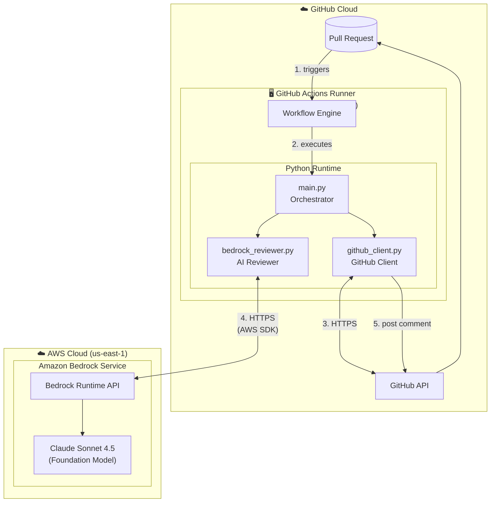
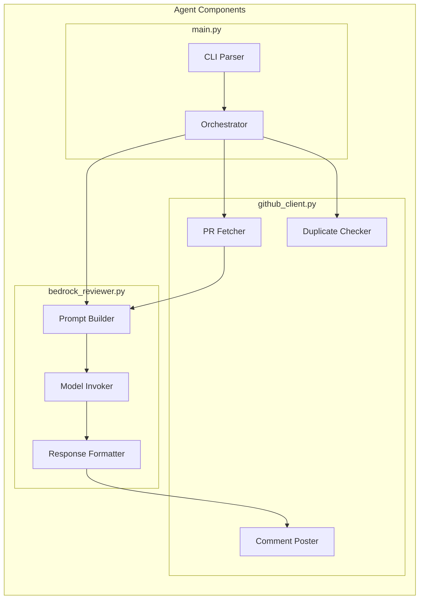
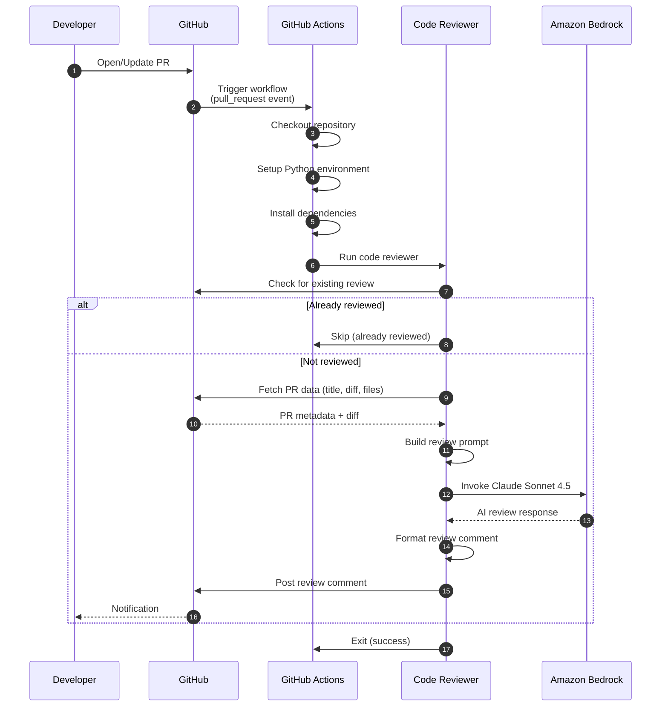
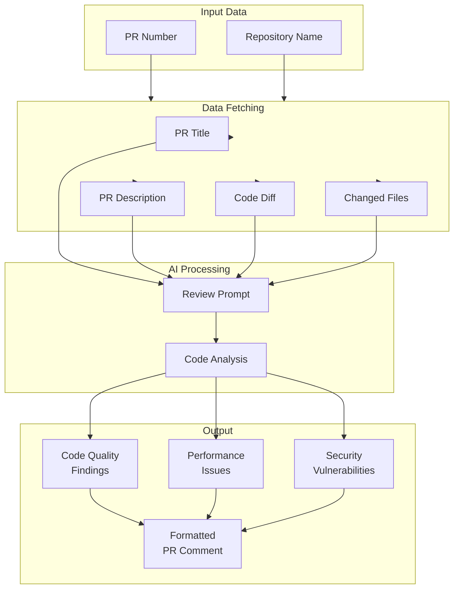
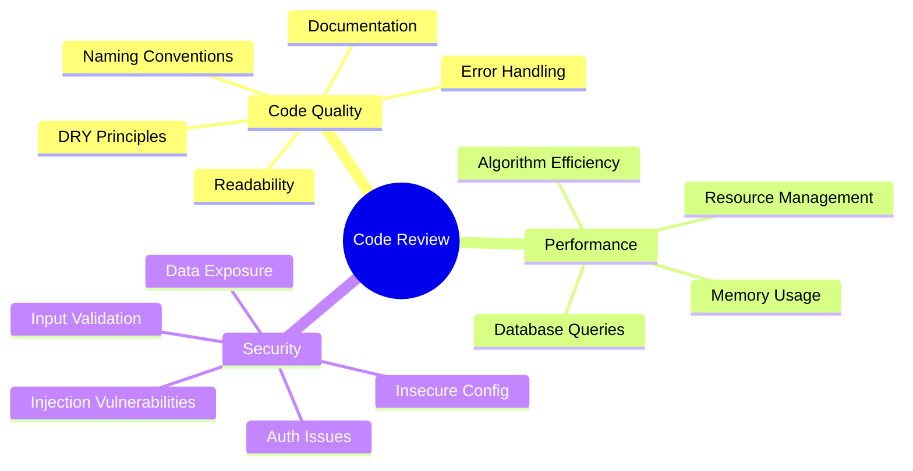
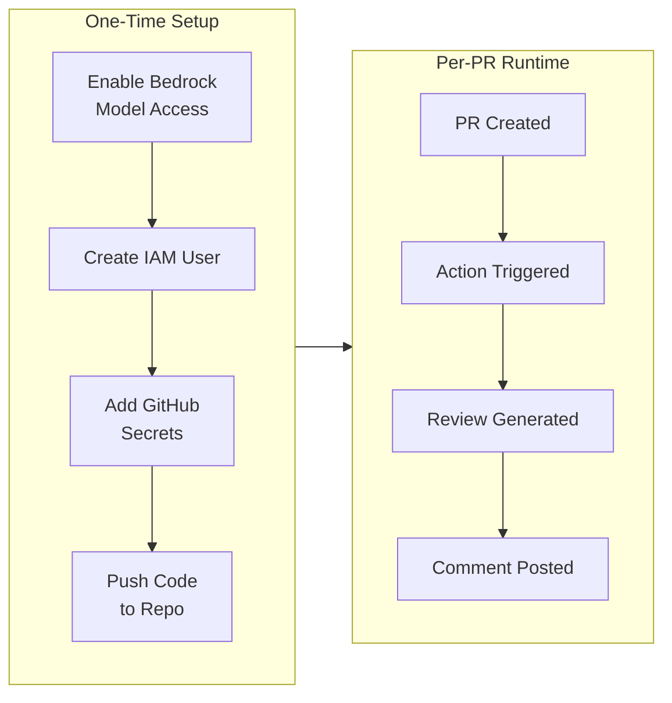
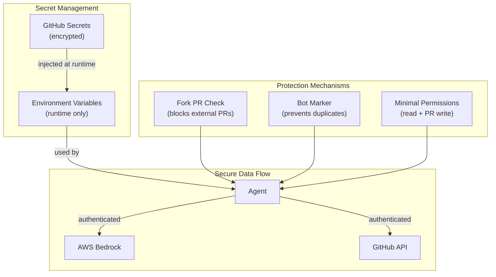
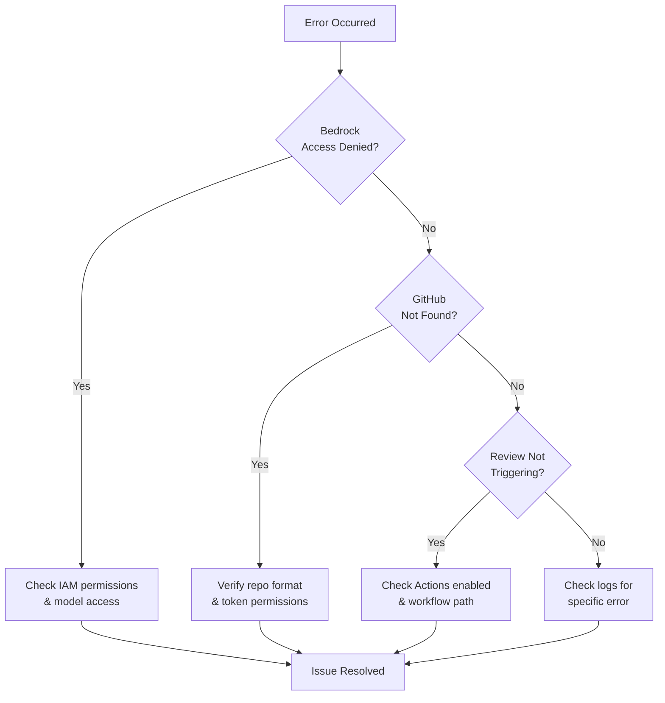

# Amazon Bedrock PR Code Reviewer

Automated pull request code reviewer powered by Amazon Bedrock and Claude Sonnet 4.5.

## Features

- Automated code review on PR creation/update via GitHub Actions
- Reviews focus on:
  - Code quality and best practices
  - Performance issues
  - Security vulnerabilities
- Posts a single summary comment on the PR
- Skips duplicate reviews (won't comment twice on the same PR)

---

## Architecture Overview

### High-Level Architecture



### Runtime Environments

| Component | Hosted On | Lifecycle |
|-----------|-----------|-----------|
| Pull Request & API | GitHub Cloud | Persistent |
| GitHub Actions Runner | GitHub-hosted Ubuntu VM | Ephemeral (per workflow run) |
| Code Reviewer Agent | Inside Actions Runner | Ephemeral (per workflow run) |
| Amazon Bedrock | AWS Cloud (your region) | Managed service (always available) |
| Claude Sonnet 4.5 | AWS Bedrock | Foundation model (serverless) |

### Component Architecture



---

## Workflow

### GitHub Action Trigger Flow



### Data Flow



### Review Categories



---

## Project Structure

```
.
├── .github/
│   └── workflows/
│       └── code-review.yml    # GitHub Action workflow
├── scripts/
│   ├── deploy.sh              # One-command deployment
│   ├── setup-aws.sh           # AWS IAM setup
│   ├── setup-github.sh        # GitHub secrets setup
│   ├── run-local.sh           # Local code review runner
│   └── cleanup.sh             # Remove all resources
├── src/
│   ├── __init__.py
│   ├── github_client.py       # GitHub API interactions
│   ├── bedrock_reviewer.py    # Bedrock/Claude integration
│   └── main.py                # Main entry point
├── requirements.txt
├── README.md                  # This file (architecture & overview)
└── DEPLOYMENT.md              # Step-by-step deployment guide
```

### Module Responsibilities

| Module | Responsibility |
|--------|----------------|
| `main.py` | CLI parsing, orchestration, error handling |
| `github_client.py` | Fetch PR data, post comments, check duplicates |
| `bedrock_reviewer.py` | Build prompts, invoke Claude, format responses |

---

## Quick Start

### Automated Deployment (Recommended)

```bash
# One-command deploy (requires AWS CLI + GitHub CLI)
./scripts/deploy.sh
```

### Manual Deployment

For detailed step-by-step deployment instructions, see **[DEPLOYMENT.md](./DEPLOYMENT.md)**.

### Local Testing

```bash
# Run a code review locally
./scripts/run-local.sh --pr 123 --dry-run
```

### Prerequisites

- AWS account with Bedrock access
- GitHub repository with admin access

### Required Secrets

Add these to your GitHub repository (**Settings → Secrets → Actions**):

| Secret | Description |
|--------|-------------|
| `AWS_ACCESS_KEY_ID` | IAM user access key |
| `AWS_SECRET_ACCESS_KEY` | IAM user secret key |

> `GITHUB_TOKEN` is automatically provided by GitHub Actions.

---

## Deployment Flow



---

## Local Usage

You can also run the reviewer locally:

```bash
# Install dependencies
pip install -r requirements.txt

# Set environment variables
export GITHUB_TOKEN="your-github-pat"
export AWS_ACCESS_KEY_ID="your-aws-key"
export AWS_SECRET_ACCESS_KEY="your-aws-secret"
export AWS_REGION="us-east-1"

# Run review (dry run)
python -m src.main --repo "owner/repo" --pr 123 --dry-run

# Run review and post comment
python -m src.main --repo "owner/repo" --pr 123

# Force re-review (even if already commented)
python -m src.main --repo "owner/repo" --pr 123 --force
```

### CLI Options

| Option | Description |
|--------|-------------|
| `--repo` | Repository in `owner/repo` format (required) |
| `--pr` | Pull request number (required) |
| `--skip-if-reviewed` | Skip if bot already commented (default: true) |
| `--force` | Force review even if already commented |
| `--dry-run` | Print review without posting to GitHub |

---

## Security Architecture



### Security Notes

- The workflow only runs on PRs from the same repository (not forks) to protect secrets
- AWS credentials are stored as GitHub secrets and never exposed in logs
- The bot marker prevents duplicate reviews
- Minimal permissions: only `contents: read` and `pull-requests: write`

---

## Customization

### Modify Review Focus

Edit the prompt in `src/bedrock_reviewer.py:_build_review_prompt()` to customize what the reviewer looks for.

### Change the Model

Update `MODEL_ID` in `src/bedrock_reviewer.py` to use a different Claude model:

```python
MODEL_ID = "anthropic.claude-3-opus-20240229-v1:0"  # For Claude 3 Opus
```

### Add Inline Comments

To add line-by-line comments instead of a summary, modify `github_client.py` to use the GitHub Reviews API:

```python
pr.create_review(body="Review body", event="COMMENT", comments=[...])
```

---

## Troubleshooting

> For detailed troubleshooting steps, see [DEPLOYMENT.md](./DEPLOYMENT.md#troubleshooting).

### Error Resolution Flow



### Common Issues

| Issue | Solution |
|-------|----------|
| Access Denied from Bedrock | Verify IAM `bedrock:InvokeModel` permission and model access |
| Resource not found from GitHub | Check repo format (`owner/repo`) and token permissions |
| Review not triggering | Ensure Actions enabled and workflow in `.github/workflows/` |
| Duplicate reviews | Bot marker should prevent this; use `--force` to override |

---

## License

MIT
