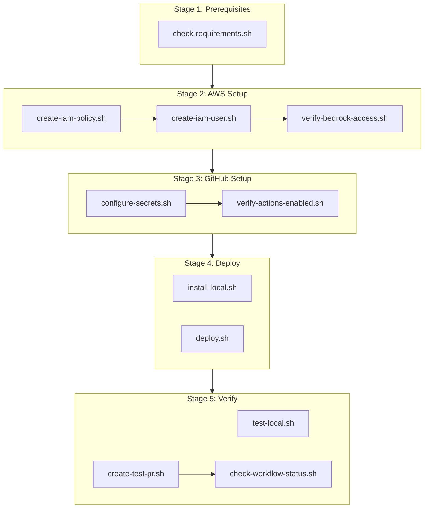

# Deployment Scripts

Staged scripts for deploying the Amazon Bedrock PR Code Reviewer.

## Script Stages

```
scripts/
├── 00-quick-start/        # One-command scripts (all-in-one)
│   ├── deploy.sh              # Full deployment in one command
│   ├── setup-aws.sh           # AWS setup only
│   ├── setup-github.sh        # GitHub setup only
│   ├── run-local.sh           # Run code review locally
│   └── cleanup.sh             # Remove all resources
├── 01-prerequisites/       # Check required tools
│   └── check-requirements.sh
├── 02-aws-setup/          # AWS IAM & Bedrock setup
│   ├── create-iam-policy.sh
│   ├── create-iam-user.sh
│   ├── verify-bedrock-access.sh
│   └── bedrock-policy.json
├── 03-github-setup/       # GitHub secrets & Actions
│   ├── configure-secrets.sh
│   └── verify-actions-enabled.sh
├── 04-deploy/             # Deploy to repository
│   ├── deploy.sh
│   └── install-local.sh
└── 05-verify/             # Test deployment
    ├── create-test-pr.sh
    ├── check-workflow-status.sh
    └── test-local.sh
```

## Deployment Flow



## Quick Start

### One-Command Deployment

Use the scripts in `00-quick-start/` for the fastest setup:

```bash
# Full deployment (AWS + GitHub + push)
./scripts/00-quick-start/deploy.sh

# Or run locally without deploying
./scripts/00-quick-start/run-local.sh --pr 123 --dry-run

# Cleanup everything when done
./scripts/00-quick-start/cleanup.sh
```

### Step-by-Step Deployment (GitHub Action)

Run staged scripts in order:

```bash
# Stage 1: Check prerequisites
./scripts/01-prerequisites/check-requirements.sh

# Stage 2: AWS setup (requires AWS CLI configured)
./scripts/02-aws-setup/create-iam-policy.sh
./scripts/02-aws-setup/create-iam-user.sh
./scripts/02-aws-setup/verify-bedrock-access.sh

# Stage 3: GitHub setup (requires GitHub CLI)
./scripts/03-github-setup/configure-secrets.sh
./scripts/03-github-setup/verify-actions-enabled.sh

# Stage 4: Deploy
./scripts/04-deploy/deploy.sh

# Stage 5: Verify
./scripts/05-verify/create-test-pr.sh
./scripts/05-verify/check-workflow-status.sh
```

### Local Only (No GitHub Action)

If you just want to review local changes without deploying:

```bash
# Install dependencies
./scripts/04-deploy/install-local.sh

# Set credentials
export GITHUB_TOKEN='ghp_...'
export AWS_ACCESS_KEY_ID='AKIA...'
export AWS_SECRET_ACCESS_KEY='...'

# Review any PR
./scripts/05-verify/test-local.sh <PR_NUMBER>

# Or run directly
python -m src.main --repo owner/repo --pr 123 --dry-run
```

## Script Details

### Stage 0: Quick Start (All-in-One)

| Script | Description |
|--------|-------------|
| `deploy.sh` | Full deployment: AWS + GitHub + git push |
| `setup-aws.sh` | AWS-only: IAM user, policy, access keys |
| `setup-github.sh` | GitHub-only: configure repository secrets |
| `run-local.sh` | Run code review locally on any PR |
| `cleanup.sh` | Remove all AWS and GitHub resources |

### Stage 1: Prerequisites

| Script | Description |
|--------|-------------|
| `check-requirements.sh` | Verifies Python, pip, git, AWS CLI, GitHub CLI |

### Stage 2: AWS Setup

| Script | Description |
|--------|-------------|
| `create-iam-policy.sh` | Creates IAM policy for Bedrock access |
| `create-iam-user.sh` | Creates IAM user and generates access keys |
| `verify-bedrock-access.sh` | Tests Bedrock model invocation |
| `bedrock-policy.json` | IAM policy document |

### Stage 3: GitHub Setup

| Script | Description |
|--------|-------------|
| `configure-secrets.sh` | Adds AWS credentials to GitHub Secrets |
| `verify-actions-enabled.sh` | Checks GitHub Actions is enabled |

### Stage 4: Deploy

| Script | Description |
|--------|-------------|
| `deploy.sh` | Commits and pushes code to repository |
| `install-local.sh` | Installs Python dependencies locally |

### Stage 5: Verify

| Script | Description |
|--------|-------------|
| `create-test-pr.sh` | Creates a test PR with intentional issues |
| `check-workflow-status.sh` | Monitors workflow execution |
| `test-local.sh` | Runs code reviewer locally (dry-run) |

## Requirements

- **Bash** (macOS/Linux or Git Bash on Windows)
- **AWS CLI** (for Stage 2)
- **GitHub CLI** (for Stage 3, 5)
- **Python 3.9+** (for local testing)
